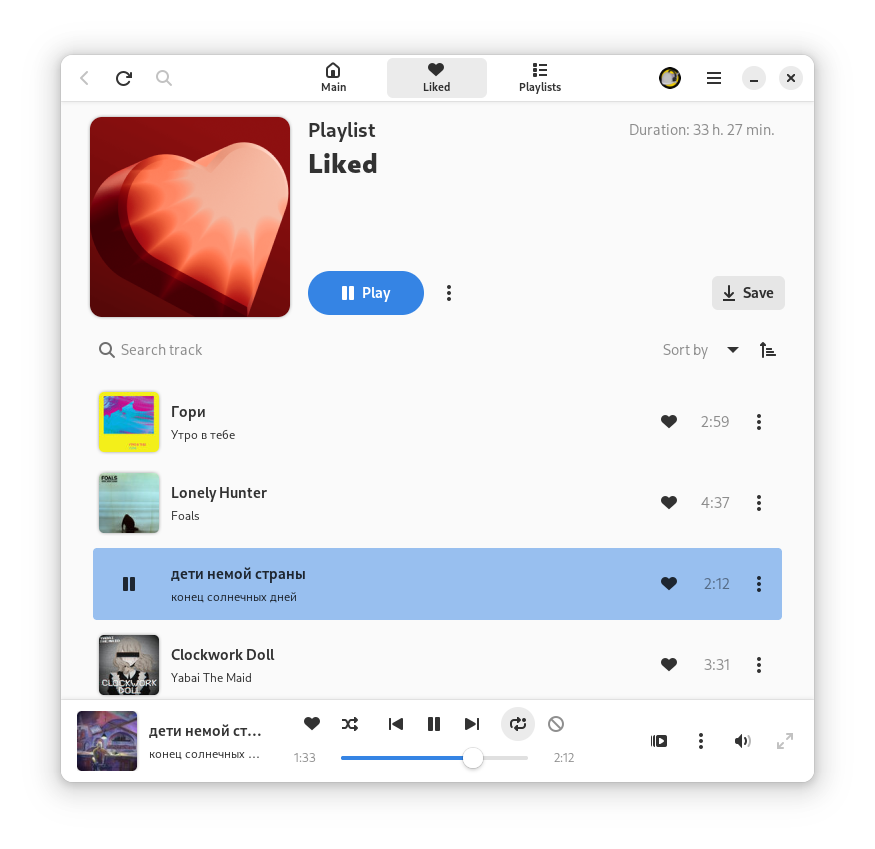

<h1 align="center">
  
  <br/>
  Cassette
</h1>

<p align="center">
  GTK4/Adwaita приложение, которое позволит вам использовать Я.Музыку на Linux.
</p>

<br/>

<p align="center">
  <a href="https://flathub.org/apps/details/io.github.Rirusha.Cassette">
    
  </a>
  <br>
  <br>
  <a href="https://stopthemingmy.app">
    
  </a>
  <br>
  <a href="https://t.me/CassetteGNOME_Devlog">
    
  </a>
  <br>
  <a href="https://t.me/CassetteGNOME_Discussion">
    
  </a>
</p>

<p align="center">
    
</p>


## Ход текущей разработки
[](https://github.com/Rirusha/Cassette/milestone/2) \
[](https://github.com/Rirusha/Cassette/milestone/8)

Все запланированные фичи можете [посмотреть в бэклоге](https://github.com/users/Rirusha/projects/2)


## Установка из репозитория

Приложение Cassette доступно здесь:

[](https://repology.org/project/cassette/versions)

### ALT Sisyphus
```shell
su -
apt-get install cassette
```

### Arch Linux

> [!NOTE]
> Большинство AUR Helper'ов поддерживает Pacman-style флаги, например, yay.

#### yay
```shell
yay -S cassette
```

#### pamac
```shell
pamac install cassette
```


## Установка c помощью Flatpak

Вы можете скачать по [ссылке](https://flathub.org/apps/details/io.github.Rirusha.Cassette) или используя терминал

```shell
flatpak install io.github.Rirusha.Cassette
```


## Nightly версия

> [!WARNING]
> Данная версия собирается и обновляется при каждом изменение в коде, поэтому может оказаться нестабильной.

### Flatpak

#### Подключаем репозиторий `gnome-nightly` и устанавливаем GNOME Platform:
```shell
flatpak remote-add --if-not-exists gnome-nightly https://nightly.gnome.org/gnome-nightly.flatpakrepo
flatpak install gnome-nightly org.gnome.Platform//master
```

#### Подключаем Nightly репозиторий и устанавливаем приложение:
```shell
flatpak remote-add --if-not-exists cassette-nightly https://rirusha.github.io/Cassette/index.flatpakrepo
flatpak install cassette-nightly io.github.Rirusha.Cassette-Devel
```

#### Для удаления репозитория нужно выполнить:
```shell
flatpak remote-delete cassette-nightly
```

### Arch Linux

> [!NOTE]
> При необходимости, в arch-подобных системах можно установить Nightly версию из репозитория AUR. 
> По возможности рекомендуется использовать Flatpak версию.
>
> Большинство AUR Helper'ов поддерживает Pacman-style флаги, например, yay.

#### yay
```shell
yay -S cassette-git
```

#### pamac
```shell
pamac install cassette-git
```

### NixOS
```shell
nix run github:Rirusha/Cassette
```

## Установка в Windows

Способы установки приложения в Windows описаны [здесь](docs/INSTALLATION_ON_WINDOWS.md).


## Сборка из исходного кода

#### Зависимости:
* `gtk4`, version: `>= 4.14`
* `libadwaita-1`, version: `>= 1.5`
* `libsoup-3.0`
* `gdk-pixbuf-2.0`
* `json-glib-1.0`
* `sqlite3`
* `gee-0.8`
* `libxml-2.0`
* `gstreamer-1.0`
* `webkitgtk-6.0`
* `gio-2.0`, version: `>= 2.72`
* `git`, только для `devel`

#### Утилиты для сборки:
* `meson`
* `ninja`
* `cmake`
* `blueprint-compiler`
* `gcc`
* `valac`
* `pkg`
* `appstream-utils`

### Сборка:

#### latest
> [!NOTE]
> В данной версии будут недоступны нестабильные функции, находящиеся в разработке.
```shell
meson setup builddir
```

#### devel
> [!WARNING]
> В данной версии будут доступны все devel функции, приложение может работать нестабильно.
```shell
meson setup builddir
meson configure -Dprofile=development builddir
```

### Тестирование
```shell
ninja -C builddir test
```

### Установка:
```shell
sudo ninja -C builddir install
```

### Удаление:
```shell
sudo ninja -C builddir uninstall
```


## Решение проблем

Решение известных проблем описано на странице Cassette на [ALT Gnome Wiki](https://alt-gnome.wiki/cassette.html#решение-проблем).

Также загляните во вкладку [issues](https://github.com/Rirusha/Cassette/issues), если вашей проблемы нет и там, расскажите о ней, заведя новый [issue](https://github.com/Rirusha/Cassette/issues/new).


## Для разработчиков

### Использование Visual Studio Code
Репозиторий имеет рекомендуемые расширения для проверки и запуска приложения с gdb.

### Зависимости

#### репозиторий [gnome-nightly](https://wiki.gnome.org/Apps/Nightly):
```shell
flatpak remote-add --if-not-exists gnome-nightly https://nightly.gnome.org/gnome-nightly.flatpakrepo
```

#### Для запуска
`org.gnome.Platform//master`
```shell
flatpak install org.gnome.Platform//master
```

#### Для сборки
`org.gnome.Sdk//master` \
`org.freedesktop.Sdk.Extension.vala//23.08beta`
```shell
flatpak install org.gnome.Sdk//master org.freedesktop.Sdk.Extension.vala//23.08beta
```


## Поддержка
Вы можете поддержать несколькими способами:
- Создать ишью с проблемой или предложением по улучшению
- Отправить pull request с фиксом или добавлением функционала
- Поддержать рублём (Просьба указывать в "Сообщении получателю" свой никнейм при отправлении через Тинькофф):

  <p>
    <a href="https://www.tinkoff.ru/cf/21GCxLuFuE9">
      
    </a>
  </p>
  <p>
    <a href="https://boosty.to/rirusha/donate">
      
    </a>
  </p>


## Благодарность
Спасибо [MarshalX](https://github.com/MarshalX). Библиотека [yandex-music-api](https://github.com/MarshalX/yandex-music-api) была использована в качестве документации к api.

> [!NOTE]
Cassette - неофициальный клиент, не связан с компанией Яндекс и не одобрен ей.
