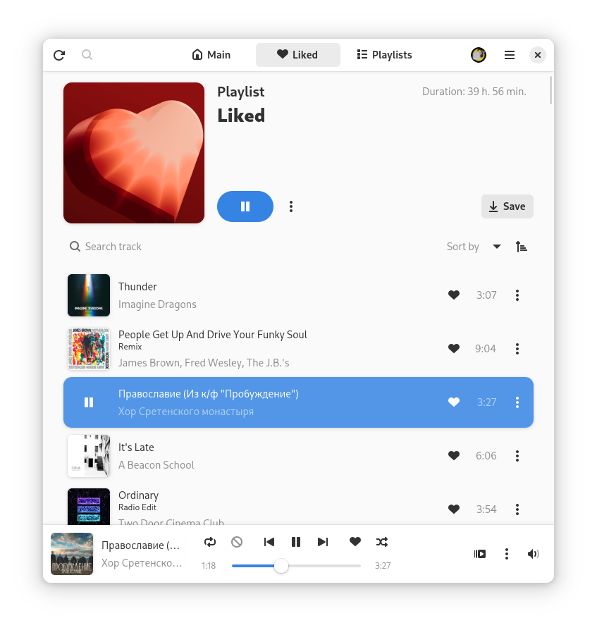

README language: \
[](README.md)
[](docs/README-ru.md)

<div align="center">
  <h1>
    
    Cassette
  </h1>

  <a href="https://stopthemingmy.app">
    
  </a>

  <a href="https://t.me/CassetteGNOME_Devlog">
    
  </a>

  <a href="https://t.me/CassetteGNOME_Devlog">
    
  </a>
</div>

<div align="center"><h4>GTK4/Adwaita application that allows you to use Yandex Music service on Linux operating systems.</h4></div>

<div align="center">
  
</div>

## Install

**Flathub:**

<a href="https://flathub.org/apps/details/space.rirusha.Cassette">
  
</a>

```shell
flatpak install space.rirusha.Cassette
```

**Distribution repositories:**

[](https://repology.org/project/cassette/versions)

### ALT Linux
```shell
su -
apt-get install cassette
```

### Arch Linux

> Most AUR Helpers support Pacman-style flags, for example, yay.

#### yay
```shell
yay -S cassette
```

#### pamac
```shell
pamac install cassette
```

### NixOS Unstable	
```shell
nix-shell -p cassette
```

## Building

#### Dependencies:

* `gtk4`, version: `>= 4.14`
* `libadwaita-1`, version: `>= 1.5`
* `libsoup-3.0`
* `gdk-pixbuf-2.0`
* `json-glib-1.0`
* `sqlite3`
* `gee-0.8`
* `libxml-2.0`
* `gstreamer-1.0`
* `webkitgtk-6.0`
* `gio-2.0`, version: `>= 2.72`
* `git`, only for `devel`

#### Building utilities:

* `meson`
* `ninja`
* `cmake`
* `blueprint-compiler`
* `gcc`
* `valac`
* `pkg`
* `appstream-utils`

### PreRelease

> Unstable features under development will not be available in this version.
```shell
meson setup _build
```

### `is_devel` flag

> In this version, all devel functions will be available.
```shell
meson setup _build -Dis_devel=true
```

#### Install
```shell
sudo ninja install -C _build
```

#### Testing
```shell
ninja -C _build test
```

#### Uninstal
```shell
sudo ninja uninstall -C _build
```

## Devel version

> This version is built and updated with every commit, so it may be unstable.

You need to add `cassette-nightly` and `gnome-nightly` repositories:

```shell
flatpak remote-add --if-not-exists gnome-nightly https://nightly.gnome.org/gnome-nightly.flatpakrepo
flatpak remote-add --if-not-exists cassette-nightly https://rirusha.space/repos/cassette-nightly.flatpakrepo
```

Install application:

```shell
flatpak install cassette-nightly space.rirusha.Cassette.Devel
```

## For developers

> The repository has recommended extensions for developing with Visual Studio Code.

### Dependencies

#### repository [gnome-nightly](https://wiki.gnome.org/Apps/Nightly):
```shell
flatpak remote-add --if-not-exists gnome-nightly https://nightly.gnome.org/gnome-nightly.flatpakrepo
```

#### To run
`org.gnome.Platform//master`
```shell
flatpak install org.gnome.Platform//master
```

#### To build
`org.gnome.Sdk//master` \
`org.freedesktop.Sdk.Extension.vala//23.08beta`
```shell
flatpak install org.gnome.Sdk//master org.freedesktop.Sdk.Extension.vala//23.08beta
```

## Support

You can support in several ways:
- Create an issue with a problem or a suggestion for improvement
- Submit a merge request with a fix or new functionality
- Support financially (Please include your nickname in the "Message to the recipient" when sending via T-Bank)

<br>

<div align="center">
  <a href="https://www.tbank.ru/cf/21GCxLuFuE9" style="margin-right: 100px;">
    
  </a>
  <a href="https://boosty.to/rirusha/donate">
    
  </a>
</div>

## Gratitude
Thank you [MarshalX](https://github.com/MarshalX ). The [yandex-music-api](https://github.com/MarshalX/yandex-music-api) library was used as api documentation.

> Attention!
> Cassette is an unofficial client, not affiliated with Yandex and not approved by it.
