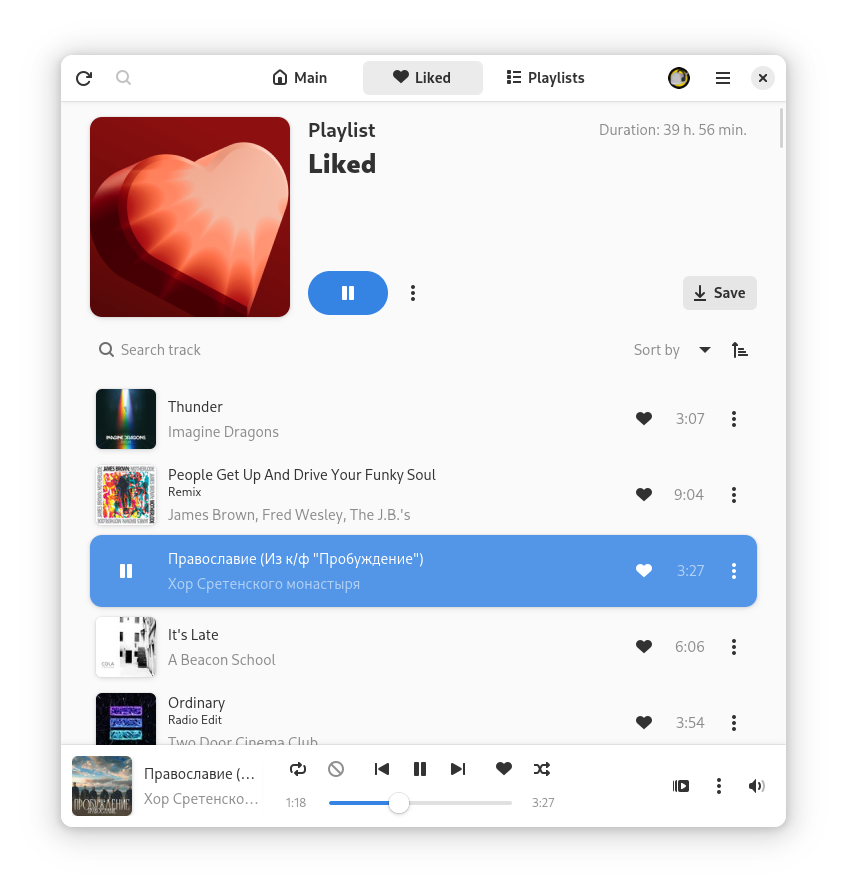

<div align="center">
  

  <h1>Кассета</h1>
  <p>Неофициальный клиент Яндекс Музыки</p>

  <a href="https://stopthemingmy.app">
    
  </a>

  <div>
  <a href="https://alt-gnome.altlinux.team/matrix-to/#/#cassette-discussion:altlinux.org">
    
  </a>

  <a href="https://translate.alt-gnome.ru/engage/cassette/">
    
  </a>

  <a href="https://t.me/CassetteGNOME_Devlog">
    
  </a>

  <a href="https://t.me/CassetteGNOME_Discussion">
    
  </a>
  </div>
</div>

<div align="center"><h4>GTK4/Adwaita приложение, которое позволит вам использовать Я.Музыку на Linux.</h4></div>

<div align="center">
  
</div>

## Установка

**Flathub:**

<a href="https://flathub.org/apps/details/space.rirusha.Cassette">
  
</a>

**Репозитории дистрибутивов:**

[](https://repology.org/project/cassette/versions)

## Сборка

Вы можете использовать [GNOME Builder](https://flathub.org/en/apps/org.gnome.Builder), [VSC/odium с `flatpak` плагином](https://marketplace.visualstudio.com/items?itemName=bilelmoussaoui.flatpak-vscode) или просто с [flatpak-builder](https://docs.flatpak.org/en/latest/first-build.html#build-and-install)

Также вы можете собрать через meson с ручным разрешением зависимостей. Опции сборки можно посмотреть [здесь](meson.options)

### Платформы

Кассета доступна на других платформах, помимо Linux. Информация размещена в соответствующих каталогах в корневом каталоге репозитория. На данный момент представлены `windows` и `macos`.

## Версия "В разработке"

> Эта версия обновляется после каждого изменения, так что она может быть нестабильна.

Нужно добавить `cassette-nightly` и `gnome-nightly` репозиторий:

```shell
flatpak remote-add --if-not-exists gnome-nightly https://nightly.gnome.org/gnome-nightly.flatpakrepo
flatpak remote-add --if-not-exists cassette-nightly https://rirusha.space/repos/cassette-nightly.flatpakrepo
```

Установка приложения:

```shell
flatpak install cassette-nightly space.rirusha.Cassette.Devel
```

## Поддержка

Вы можете поддержать несколькими способами:
- Создать issue с проблемой или предложением по улучшению
- Отправить merge request с фиксом или добавлением функционала
- Поддержать рублём (Просьба указывать в "Сообщении получателю" свой никнейм при отправлении через Т-Банк):

Ссылки на донаты (QR-коды кликабельны!):
<details>
  <summary>T-Bank</summary>
  <a href="https://www.tbank.ru/cf/21GCxLuFuE9">
    
  </a>
</details>

<details>
  <summary>Boosty</summary>
  <a href="https://boosty.to/rirusha/donate">
    
  </a>
</details>

<br>

> Внимание!
> Кассета - неофициальный клиент, не связан с компанией Яндекс и не одобрен ей.
